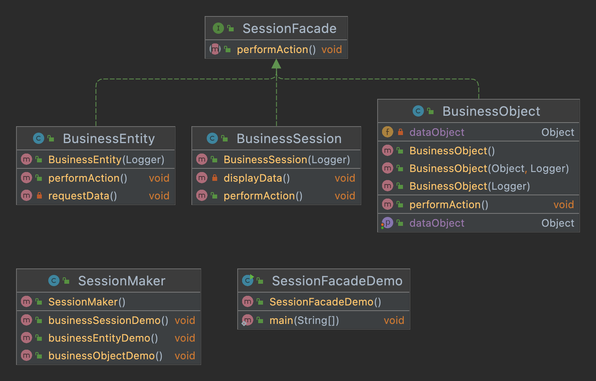

## Intent
Facade pattern intents to conceal the complexity of the implementation and presents to the user an interactable interface.

## Class diagram

## Applicability

Use this pattern when

* A simplification is needed for the interaction between the system and the user.

## Credits

* [J2EE Design Patterns](https://www.amazon.com/gp/product/0596004273/ref=as_li_tl?ie=UTF8&camp=1789&creative=9325&creativeASIN=0596004273&linkCode=as2&tag=javadesignpat-20&linkId=48d37c67fb3d845b802fa9b619ad8f31)
